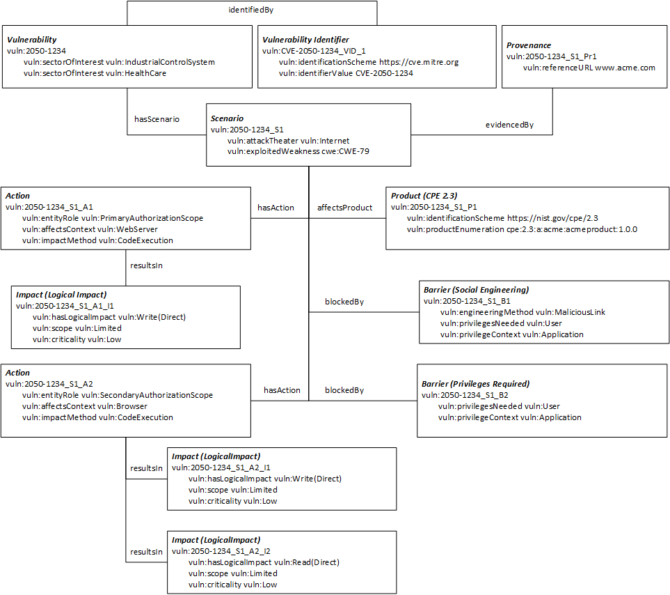

# Human readable text based on XSS-Example.png

This displays how human readable descriptions can be derived from a vulntological representation of a vulnerability.  

Legend: 
**Object** 
[**Object Instantiation**] 
*Property* 
[*Value*] 

---

There is a **vulnerability**, *known as* [*CVE-2050-1234*]. It is of importance to the [*Industrial Control System*] and [*Health Care*] *sectors*. 
The **vulnerability** is due to code that originates from [*Acme Acmeproduct 1.0.0.*]  
The **vulnerability** [*CVE-2050-1234*] has [**one**] **scenario** that is an [*internet*] based [*cross-site scripting*].  
The [**first**] **scenario** is *evidenced by* [*www.acme.com*] 
The [**first**] **scenario** *affects product* [*Acme Acmeproduct 1.0.0.*]  
The [**first**] **scenario** is *blocked by* **social engineering** of an [*application*] [*user*] via a [*malicious link*] and requiring [*user*] [*application*] **privileges**.  
The [**first**] **action** of the [**first**] **scenario** is [*code execution*] to the [*webserver*] which is the [*primary authorization scope*]. 
The [**first**] **impact** of the [**first**] **action** is a [*low*] *criticality*, [*limited*] *scope*, [*direct write*]. 
The [**second**] **action** of the [**first**] **scenario** is [*code execution*] to the [*browser*] which is the [*secondary authorization scope*]. 
The [**first**] **impact** of the [**second**] **action** is a [*low*] *criticality*, [*limited*] *scope*, [*direct write*]. 
The [**second**] **impact** of the [**second**] **action** is a [*low*] *criticality*, [*limited*] *scope*, [*direct read*].  

---

