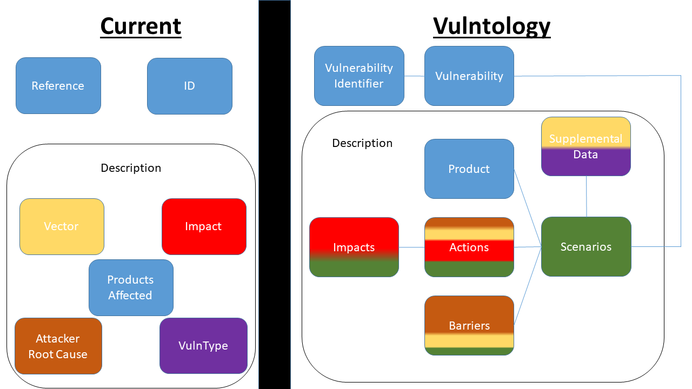

# Vulntology Introduction

When two or more groups share information, a common vocabulary is critical for success. The cybersecurity landscape is relatively new and therefore is still in its infancy in developing these shared vocabularies. The ontology described in this document is a fundamental building block in developing that shared understanding for vulnerabilities among cybersecurity professionals. For the purposes of this document a vulnerability is defined as any weakness in the computational logic found in products or devices that could be exploited by a threat source [NISTIR 7298].

The vulnerability management process consists of identifying whether an organization has endpoints containing the vulnerability, determining the exposure of the vulnerability within the organization and evaluating the impact of successful exploitation of a vulnerability within the context of the organization. An organization must determine whether the exposure and impact of a specific vulnerability warrants a response and prioritize that response among other critical activities. Organizations then need to make a similar decision for each vulnerability. The analysis needed to inform the prioritization is currently a time-consuming, manual process and is often based on reading security bulletins and vendor advisories which sometimes provide incomplete or conflicting information.

This document defines a framework that improves upon this manual process by supplying a structured format to describe vulnerabilities. Consumers of vulnerability information will be able use the vocabulary described in this framework to identify missing data points and encourage more complete and accurate vulnerability descriptions from their providers. More complete and accurate descriptions will better facilitate the vulnerability management process for organizations.

In addition to those responsible for an organization’s vulnerability management function, other stakeholders include:

* Security Researchers: who need to share and disclose vulnerability information to vendors

* Software Publishers: who need to share and disclose vulnerability information to their customers

* Vulnerability Coordinators: who need to share and disclose vulnerability information to software publishers and to users of the affected software

* Vulnerability Information Services: that need to provide vulnerability information to the consumers of their data, often performing additional analysis which can assist in the prioritization of vulnerabilities for organizations

All of these stakeholders need a common language to describe and characterize vulnerabilities as well as a way to express what information is needed to perform their activities. The framework in this document intends to provide this common language and to provide a way for stakeholders to describe required information.

A high level illustration that depicts the core differences between what is generally understood as the current model for a vulnerability and what this document proposes as enhancements to that model. While at first glance it may appear that we are taking a relatively simple system and proposing one that is far more complex, we believe that the complexity exists within both systems, but the consumer of the information is responsible for digesting the complexity in the current model where the Vulntology model displays the complexity up front in a structured manner.

The color coding associated to each box is intended to display how each of the previous concepts intertwine with the enhanced representation the Vulntology model represents.  
* Green represents new data points typically not captured.  
* Blue represents data points captured in both models that have little difference.  
* Yellow, Orange, Red and Purple all represent information relative to their respective boxes within the current model.

