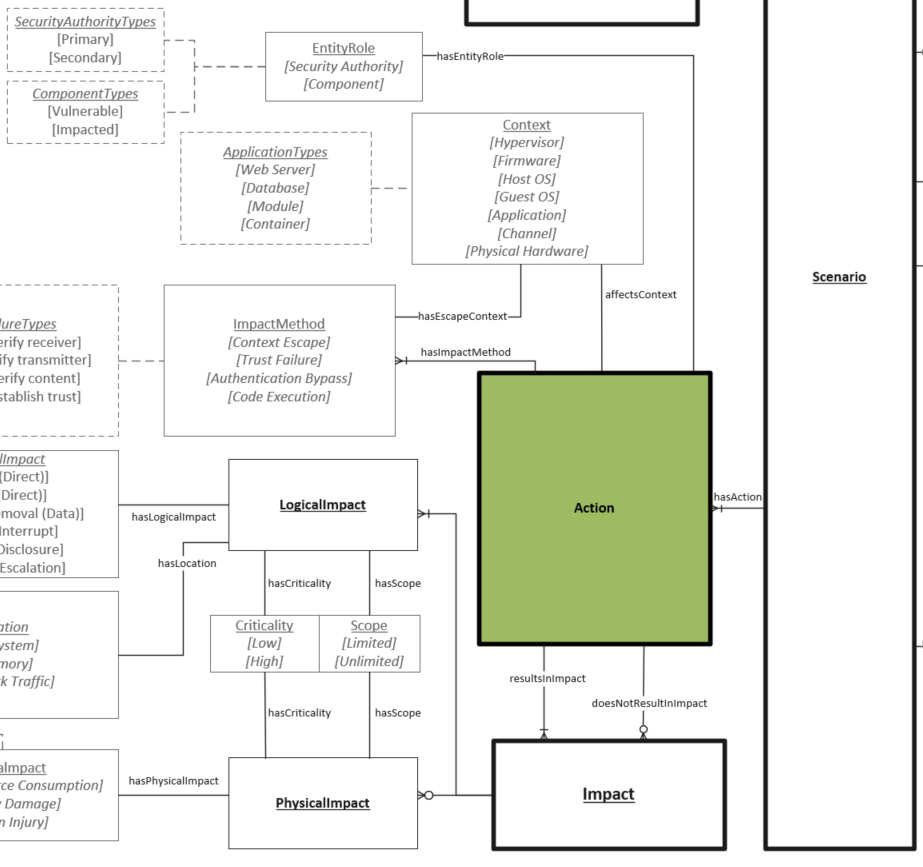

# Action Object

An Action is what occurs within a given Scenario. Actions involve a high level impact method which occur in a specific context. Actions can result in impacts to the context referenced. If multiple contexts are affected there will be multiple actions each relating to a given context.

## Properties
- **Impact Method** (one or many): A description of the method used to exploit a vulnerability providing some additional information on the impact of exploitation. (See [Impact Method](../values/impact-method.md))  
- **Affects Context** (one): The conceptual entity where the impacts are realized from successful exploitation of a security vulnerability. Different impacts can be realized by multiple contexts from multiple scenarios. (See [Context](../values/context.md))  
- **Entity Role** (one): Describes the role an associated Context performs in the Vulnerability Scenario Action being described. (See [Entity Role](../values/entity-role.md))  

## Relationships

* resultsIn: (one or many) [Impacts](impact.md) will occur due to an Action. 
* doesNotResultIn: (zero or many) [Impacts](impact.md) will not occur due to an Action.

