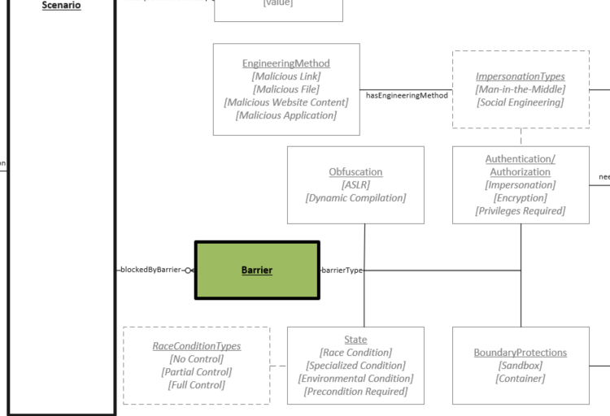

# Barrier Object

This could be any characteristic inherent in the vulnerability that could impede the adversary from achieving successful exploitation or a protection mechanism that may limit the actions or impact that can be taken even if the vulnerability is able to be exploited. These are often part of the system in which the product is deployed or are inherent in how the product is used.

## Types of Barrier
There are multiple types of Barriers and each type has one or more subtypes which represent concepts more nuanced than their parent types. Each subtype can contain type specific properties in addition to those inherited from their parent type. For example, Social Engineering could be assigned as a barrier type and would have the "Privileges Needed", "Privilege Context" and "Engineering Method" properties. 
	
- **Authentication/Authorization**:
	- **Impersonation**:
		- **SocialEngineering**: The exploit scenario requires that an attacker perform some type of social engineering to achieve a successful exploit attempt. Typically, an attacker convinces a victim to interact with a malicious resource.
		
			*Type Specific Properties* <br />
			**neededPrivileges** (zero or one): The privileges that are needed relative to the type of barrier being overcome. (See [Privilege Levels](../values/privilege-level.md))<br />
			**relatesToContext** (zero or one): The context to which the privileges are related (See [Context](../values/context.md))<br />
			**hasEngineeringMethod** (one or many): The method or mechanism used to manipulate a user into interacting with a malicious resource. (See [Engineering Method](../values/engineering-method.md)).<br />		
		- **Meddler-in-the-Middle**:  The exploit scenario requires that an adversary perform a Meddler-in-the-Middle (MitM) attack. MitM attacks involve an adversary positioning themselves inside a communication channel between two or more parties. This is usually accomplished by exploiting a trust mechanism and tricking both ends of the communication channel into believing that they are communicating with the intended party. Once successfully injected into a communication channel, the MitM is capable of sensitive data disclosure, modification of data being transmitted, transmission of false data to either party (impersonation) or denial of communication to either party.
		- **Privileges Required**:
		
			*Type Specific Properties* <br />
			**neededPrivileges** (one): The privileges that are needed relative to the type of barrier being overcome. (See [Privilege Levels](../values/privilege-level.md))
		- **Encryption**: Data or access to communication is protected through a mechansism that converts infomration into code or cipher.
 - **Obfuscation**: The attacker must overcome a protection mechansim in place that deliberately creates confusing or difficult to determine values or locations for resources or data.
	- **ASLR**: Some form of Address space layout randomization (ASLR) is in use that must be defeated to recognize impacts
	- **Binary Diversity**: The relationship of the source code and the binary is non-predictable
 - **State**:  Unique conditions exist either in process timing, implementation, architecural environment or particular configurations of a given system or systems within its influence. 
    - **Race Condition**:  The exploit scenario includes requiring an attacker to take advantage of a race condition. Race Condition has multiple [Race Condition Values](../values/race-condition.md) that can be assigned. 
    - **Specialized Condition**:  The exploit scenario requires specific, non-default configuration settings within the vulnerable software. For example, the use of a non-standard port for a networked service like ssh.
    - **Environmental Conditon**:  The exploit scenario requires an environmental condition external to the vulnerable software that is not necessarily related to the vulnerable software itself. A congested network would be an example of an environmental condition.
    - **Precondition Required**:  Information about the target is necessary in order to exploit the vulnerability on a specific target. For example, the hostname of the device may be necessary in order to exploit the vulnerability on that device.
  - **Boundary Protections**:  The attacker must be able to move through explicit boundaries that otherwise would prevent successful exploitation
  
	*Type Specific Properties* <br />
  **relatesToContext** (one): The context to which the boudary is related (See [Context](../values/context.md)).
    - **Sandbox**:  The product is deployed within a sandbox that must be broken out from to recognize impacts
    - **Container**:  The product is deployed within a type of container that must be broken out from to recognize impacts.

## Example Use
```json
"blockedByBarrier": [
    {
        "id": "S1B1",
        "hasBarrierType": "Authentication/Authorization::Impersonation::Social Engineering",
        "hasEngineeringMethod": ["MaliciousLink"],
        "neededPrivileges": "User",
        "relatesToContext": "Application"
    },
    {
        "id": "S1B2",
        "hasBarrierType": "Authentication/Authorization::Privileges Required",
        "neededPrivileges": "User",
        "relatesToContext": "Application"
    }
]
```
## Graph View
 
