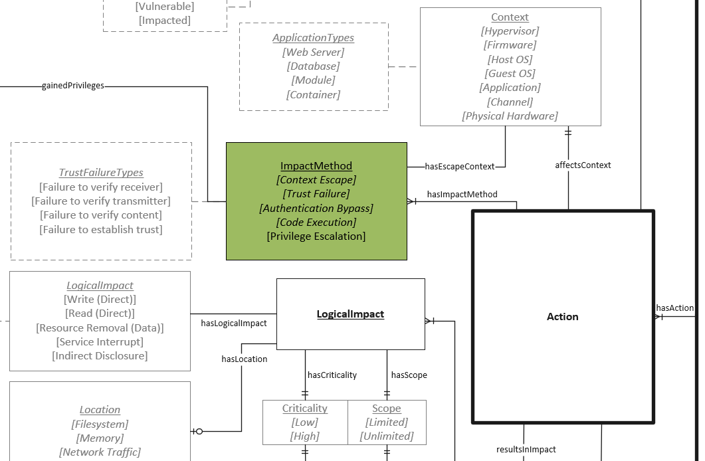

# Impact Method Object

A description of the method used to exploit a vulnerability providing some additional information on the impact of exploitation. These are intended to be high level concepts that lead to more granular impacts as referenced in the logical and physical impact entities.

## Properties

- **hasImpactMethodType** (one): The nature of impact.  See [Impact Method Types](../values/impact-method-type.md).

- **hasGainedPrivilege** (one - see notes): Abstraction to assist in capturing relative privilege levels. The abstraction is only for the sake of discussing the vulnerability and is not intended to communicate the actual granular privileges that exist in most information system environments. See [Privilege Level](privilege-level-type.md)

   Notes:
   - *Applies only when the **hasImpactMethodType**=`Privilege Escalation`*
   - *Each `hasGainedPrivilege` relates to one privilege level*.

- **hasEscapeContext** (one - see notes): The association denotes where a sandbox breakout originated. See [Context Types](../context.md).

   Notes:
   - *Applies only when the **hasImpactMethodType**=`Context Escape`*
   - *Each Context Escape relates to one context.*
  
