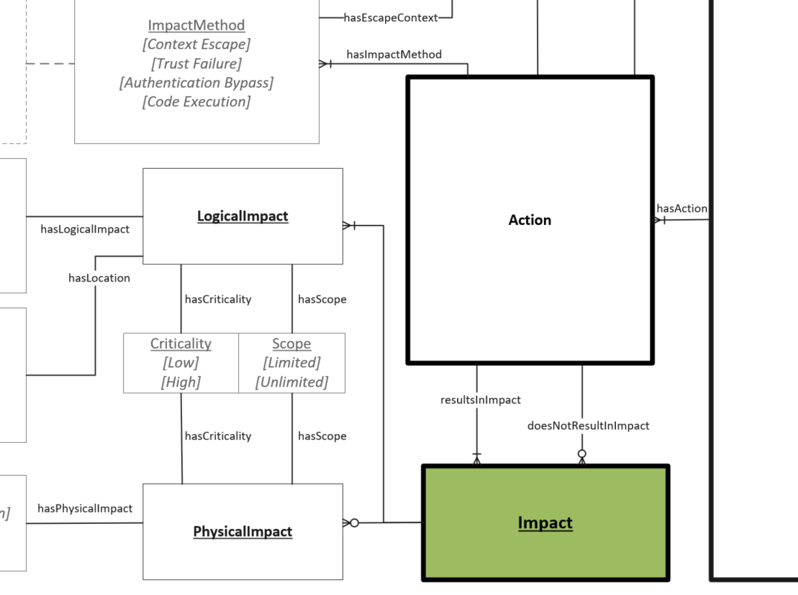

# Impact Object

An Impact is a recognized result of an Action for a given Vulnerability Scenario. 

## Properties
- **hasScope** (one):  A coarse measure of the level of impact an exploit could have on a target. (See [Scope](../values/scope.md))  
- **hasCriticality** (one): A measure of the relative importance of the associated Scope. (See [Criticality](../values/criticality.md))  

## Types of Impact

- **Logical Impact**: Impacts that occur to the digital aspects of the software. These are considered for assessing traditional notions of confidentiality, integrity and availability.   

    *Type Specific Properties*
  - **hasLogicalImpact** (one): Impacts that occur to the digital aspects of the software. These are considered for assessing traditional notions of confidentiality, integrity and availability. (See [Logical Impact](../values/logical-impact.md))   

  - **Location** (zero or one): Designating the specific area or location impacted. Serves as supplemental information (See [Locations](../values/location.md)).  
 

- **Physical Impact**: Impacts that occur the tangible aspects of what the software controls or directly influences. Common examples would be damage to assets, people or loss of resources.  

  *Type Specific Properties*
  - **hasPhysicalImpact** (zero or one): A tangible impact to a physical device, machinery, the surrounding environment, or people. (See [Physical Impact](../values/physical-impact.md))  

