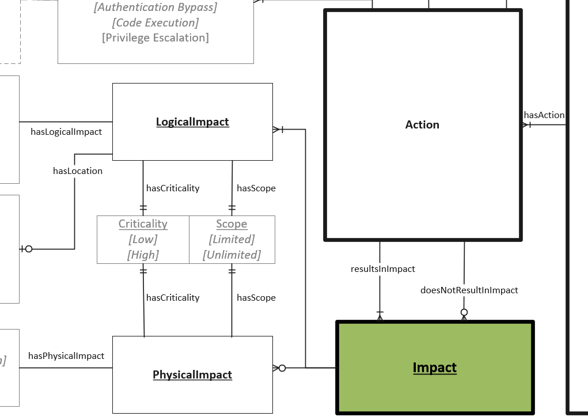

# Impact Object

An Impact is a recognized result of an Action for a given Vulnerability Scenario. 

## Properties

- **id** (one): A globally unique identifier for the impact that distinguishes it from other impacts related to the same vulnerability.
- **hasScope** (one): A coarse measure of the level of impact an exploit could have on a target. (See [Scope](../values/scope.md))
- **hasCriticality** (one): A measure of the relative importance of the associated Scope. (See [Criticality](../values/criticality.md))

The following additional properties apply respectively, when a *logical* or *physical* impact is defined. Only one of `hasLogicalImpact` or `hasPhysicalImpact` may be defined.

### Additional Logical Impact Properties

Impacts that occur to the digital aspects of the software. These are considered for assessing traditional notions of confidentiality, integrity and availability.

- **hasLogicalImpact** (one): Impacts that occur to the digital aspects of the software. These are considered for assessing traditional notions of confidentiality, integrity and availability. (See [Logical Impact](../values/logical-impact.md))

- **hasLocation** (zero or one): Designating the specific area or location impacted. Serves as supplemental information (See [Locations](../values/location.md)).

*Note: `hasLocation` only applies to logical impacts.*

### Additional Physical Impact Properties
 
Impacts that occur the tangible aspects of what the software controls or directly influences. Common examples would be damage to assets, people or loss of resources.

- **hasPhysicalImpact** (zero or one): A tangible impact to a physical device, machinery, the surrounding environment, or people. (See [Physical Impact](../values/physical-impact.md))

