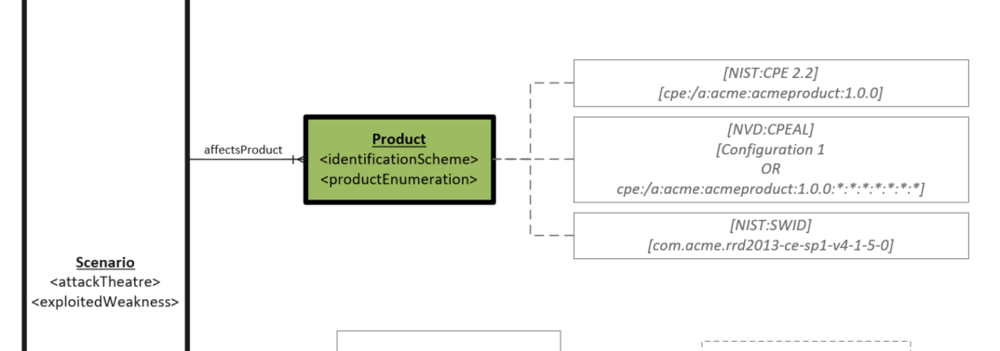

# Product Object

The software and/or hardware configurations that are known to be vulnerable to exploitation of the Vulnerability Scenario.  Different Product configurations can be associated with different Scenarios to allow for description of varying impacts and exploitation mechanisms. 

## Properties

- **hasProductEnumeration** (one or many): The enumeration of one or many products as dictated by the identification scheme. Contains a scheme and value pair. This is intended to be used for simple enumerations such as generic free text or common formats that identify explicit instances of products such as CPE or SWID.
- **hasNvdCpeApplicabilityStatement** (one): This is to reference the NVD configurations section, which requires much more complex JSON than simple strings.
- **hasCve5Product** (one): This is to reference the CVE Program CVE 5 JSON's product section, which can communicate many complicated methods of string based product applicability.

## Relationships

N/A

