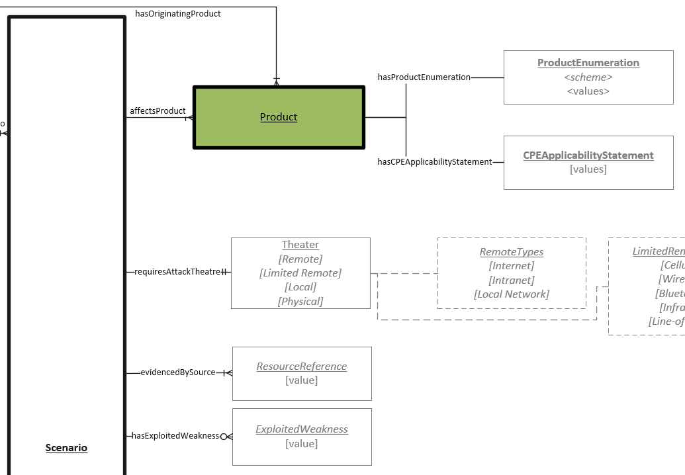

# Product Object

The software and/or hardware configurations that are known to be vulnerable to exploitation of the Vulnerability Scenario.  Different Product configurations can be associated with different Scenarios to allow for description of varying impacts and exploitation mechanisms. 

## Properties
- **Identification Scheme** (one): a namespace and scheme to identify the rules regading how a given product representation must be formatted. Examples are SWID, CPE 2.3, or CPE Applicability Language.
- **Product Enumeration** (one or many): The enumeration of one or many products as dictated by the idenfication scheme. 
- **Indicted As** (one):  [Indictment](../values/Indictment.md) Identfies if product/s listed are the origin of the fault or contain a dependency inherited through code of another source.

## Relationships

N/A

