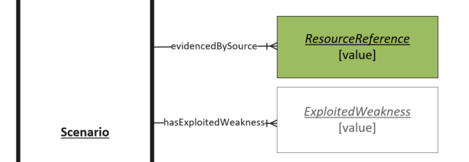

# Provenance Object

Representation of a source of information. The source which provided the information related to the Vulnerability Scenario. This is typically in the form of a URL that leads to a webpage or document hosted over the world wide web.

## Properties

- **ReferenceURL** (one): a URL that assists in identification, explanation, or origin of the Vulnerability

## Relationships

N/A

