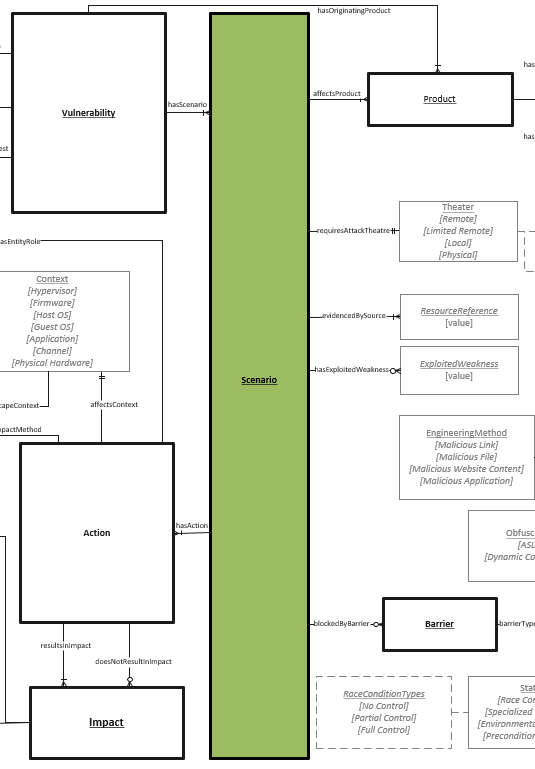

# Scenario Object

A scenario describes the conditions surrounding the possible use of a vulnerability. A Vulnerability must have a least one Scenario, with multiple possible Scenarios being common. A single Vulnerability can likely be exploited by many different approaches with possible varying impacts. Multiple Scenarios can be used to describe these variations. For example, a remote exploit could rely on user interaction to be downloaded whilst a local attacker could use the same vulnerability to obtain the same or similar impact.

## Properties
- **id** (one): An identifier for the scenario that distinguishes it from other scenarios related to the same vulnerability.
- **requiresAttackTheater** (one): Attack Theater is the area or place from which an attack must occur. Each separate theater represents varying levels of implied trust and attack surface. (See [Theater](../values/theater.md))
- **evidencedBySource** (one or many):  [Resource Reference](../values/resource-reference.md) will assist in proving a Vulnerability Scenario is legitimate. 
- **hasExploitedWeakness** (one): The weakness causing the Vulnerability. When choosing a value, the most applicable weaknesse should be selected. (See [Exploited Weakness](../values/exploited-weakness.md))

## Relationships

* affectsProduct (one or many): [Products](product.md) will be affected within a Scenario.

* blockedByBarrier (zero or many): [Barriers](barrier.md) may increase the difficulty of a Scenario.

* hasAction (one or many): [Actions](action.md) will occur within a Scenario

