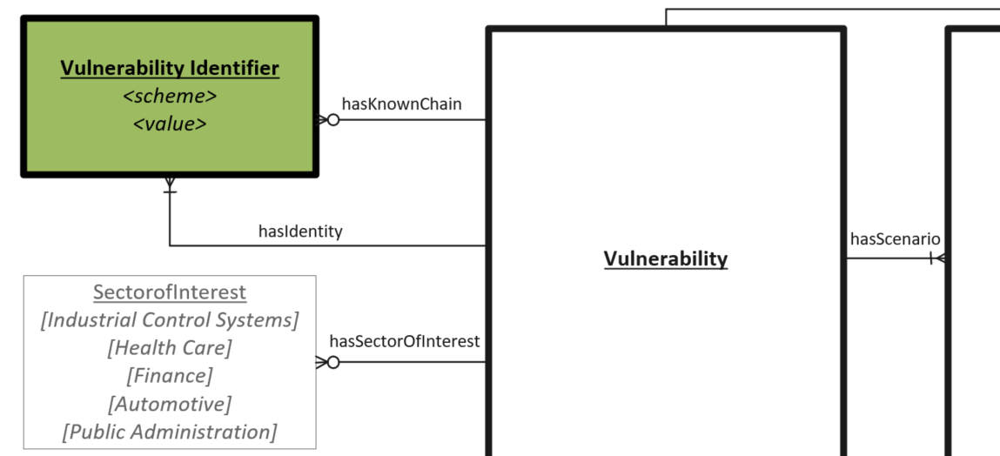

# Vulnerability Identifier Object

Examples include a knowledge base article number, patch number, a bug tracking database identifier or a common identifier such as a Common Vulnerabilities and Exposures (CVE) identifier. CVE is a widely adopted identifier used across many organizations.

## Properties
- **scheme** (one): a namespace and/or scheme to identify the rules regading how a given Vulnerability identifier should be enumerated. 
- **value** (one): The vulnerability ID based on the identification scheme 

## Relationships

None.

