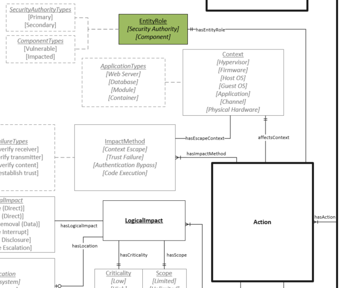

# Entity Role Values

Describes the role an associated Context performs in the vulnerability scenario being described.

## Values

- **Primary Security Authority**:  Associated Context is the primary security authority of the vulnerability scenario. See [CVSS v3.1 Section 2.2](https://www.first.org/cvss/specification-document#2-2-Scope-S) for a full description of security authorities.
- **Secondary Security Authority**:  Associated Context is a secondary security Authority of the vulnerability scenario. See [CVSS v3.1 Section 2.2](https://www.first.org/cvss/specification-document#2-2-Scope-S) for a full description of security authorities.
- **Vulnerable Component**: Associated Context is considered to contain the vulnerability. 
- **Impacted Component**:  Associated Context is is where impacts of the vulnerability are realized. The Impacted Component could also be the Vulnerable Component.

