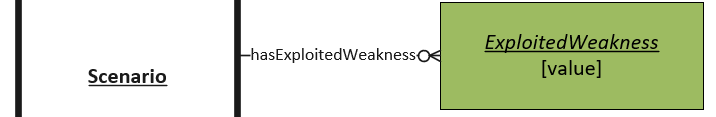

# Exploited Weakness Values

The weakness causing the Vulnerability. When choosing a value, the most applicable weaknesse should be selected.

## Values

The Common Weakness Enumeration (CWE) [CWE](https://cwe.mitre.org/about/index.html) which provides descriptions and names for various types of vulnerability weaknesses.

### Example Values:
- CWE-79
- CWE-399

