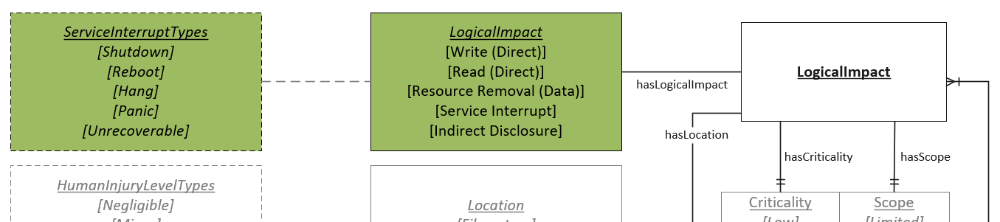

# Logical Impact Values

A description of the possible impacts to a Context that a successful exploitation of the Vulnerability will have. The same Vulnerability can have multiple and different Logical Impact values across different Context or Scenario instances.

## Values

Items that are indented represent more specific values that can be used to describe the parent value. For instance, choosing "Hang" as a value would imply "Service Interrupt" as well.

- **Indirect Disclosure**:  The Vulnerability allows an adversary to learn information about the Context, but the knowledge gained is not from a direct read operation. Examples include but are not limited to discovering memory locations protected by ASLR, information from side-channel attacks, or information gained from traffic analysis.
- **Privilege Escalation**:  The Vulnerability allows an adversary to gain a level of privilege that was not intended. Unlike the other Logical Impact noun group values, Privilege Escalation is intended to represent that anything the Privilege Level acquired can do, can be done by the adversary. If an adversary is able to only accomplish a subset of the other Logical Impact noun group values, that subset MUST be associated to the Context as well. Otherwise, all other Logical Impact noun group values are assumed.
  - **Privileges Gained**:  Abstraction to assist in capturing relative privilege levels. The abstraction is only for the sake of discussing the vulnerability and is not intended to communicate the actual granular privileges that exist in most information system environments. See [Privilege Level](privilege-level-type.md)   *Each Privilege Escalation relates to one privilege level*.
- **Read (Direct)**:  The Vulnerability allows an adversary to cause a breach of confidentiality by gaining unauthorized access to data in the Context.  
- **Resource Removal (Data)**:  The Vulnerability allows an adversary to perform an unauthorized removal (deletion) of data from a resource in the Context.
- **Service Interrupt**:  The Vulnerability allows an adversary to cause an unauthorized loss of availability by temporarily or permanently disabling all or a portion of the Context.
  - **Hang**:  The service interruption results in the Context being stuck at a certain point and unable to continue function.
  - **Panic**:  The service interruption results in the Context crashing.
  - **Reboot**:  The service interruption results in the Context being disabled, but starting back up immediately.
  - **Shutdown**:  The service interruption results in the Context being disabled, without starting back up immediately.
  - **Unrecoverable**:  The service interruption results in a complete and unrecoverable loss of the Context but is non-physical in nature. For example, the corruption of the firmware on a hardware device with no possibility of reload.
- **Write (Direct)**:  The Vulnerability allows an adversary to cause a breach in the integrity of the Context through unauthorized modification or addition of data.

