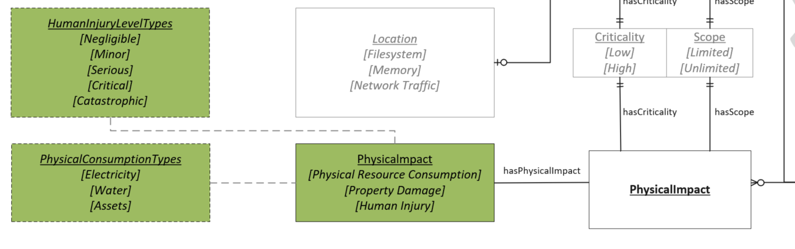

# Physical Impact Values

Used when exploitation of the Vulnerability could result in a tangible impact to a physical device, machinery, the surrounding environment, or people.

## Values

Items that are indented represent more specific values that can be used to describe the parent value. For instance, choosing "Critical" as a value would imply "Human Injury" as well.

- **Property Damage**:  An exploit of the Vulnerability could result in physical damage to the device or surrounding environment.
- **Human Injury**:  An exploit of the Vulnerability could result in injury to users or nearby individuals. Descriptions below are based on Table D.3 in [ISO/IEC 14971:2007].
  - **Negligible**:  Inconvenience or temporary discomfort
  - **Minor**:  Temporary injury or impairment not requiring professional medical intervention
  - **Serious**:  Injury or impairment requiring professional medical intervention
  - **Critical**:  Permanent impairment or life-threatening injury
  - **Catastrophic**:  Death
- **Physical Resource Consumption**:  The Vulnerability allows for consumption of resources outside the digital realm. This consumption could lead to wear and tear on the hardware or financial implications from usage.
  - **Assets**:  Exploitation of the Vulnerability enables excessive use of an asset. The excessive use could decrease the usable lifetime of the asset or unnecessarily consume fuel.
  - **Electricity**:  Exploitation of the Vulnerability enables excessive electricity usage
  - **Water**:  Exploitation of the Vulnerability enables excessive water usage

