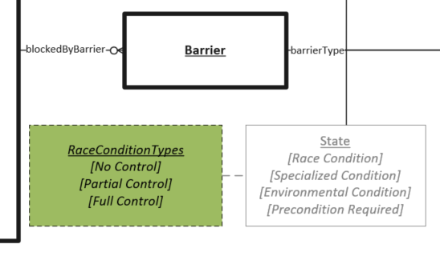

# Race Condition Values

Provides additional detail on the level of likely control an adversary has to trigger the vulnerable race condition. Note that this is only a description of how much control an attacker has over the inputs involved in the race condition and not an indication of the reproducibility of triggering the race condition itself.

## Values

 - **No Control**:  An attacker has no control over how the race condition will be triggered. The attacker must be fortunate to encounter the race condition.
 - **Partial Control**: An attacker is able to start one or more of the inputs which take part in the race condition but does not have control over all inputs. For example a vulnerability exists in the processing of a particular type of input on the intial start-up of a device and an attacker must supply that input during the period when the device is starting up and the attacker has no control over when the device starts up.
 - **Full Control**:  An attacker is able to routinely start all inputs which will trigger the race condition.
 
 