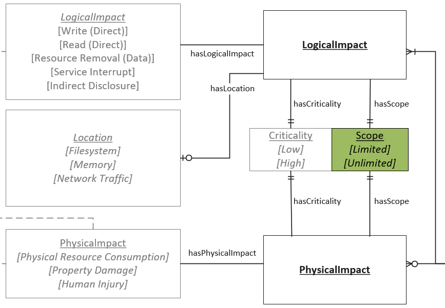

# Scope Values

A coarse measure of the level of impact an exploit could have on a target. In some cases, an impact has no constraints at all. An example of this is a vulnerability with a 'Read (Direct)' Logical Impact association in which the adversary has access to the entire system, and thus has no constraints. In other cases, an Impact might have some constraints in place. An example of this is ‘Write (Direct)’ Impact where the attacker is able to modify resources only accessible by the user.

## Values

- **Limited**:  There are restrictions to the associated impact. Limited Scope impacts shall always be associated a subvalue of it's criticality. Criticality must be considered in concert with the Context to which it is associated. That is, for a given Context (such as Guest OS or Application), the Criticality should reflect how significant an associated impact could be for the specific Context. An impact in a 'Guest OS' Context may be of lower significance than the same impact in a 'Host OS' Context and should be reflected accordingly by its associated Criticality.
- **Unlimited**:  There are no restrictions to the associated impact. This is inherently considered to be similar in severity to a limited scope, but high criticality.

